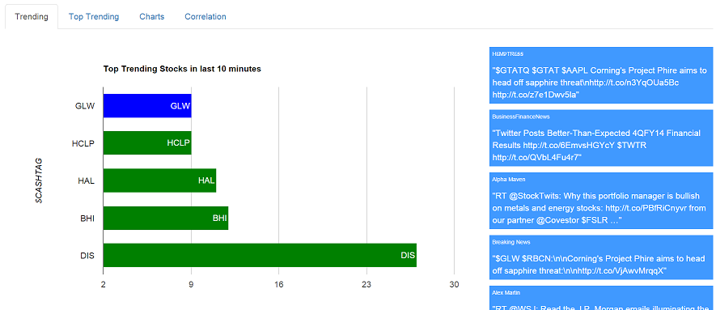
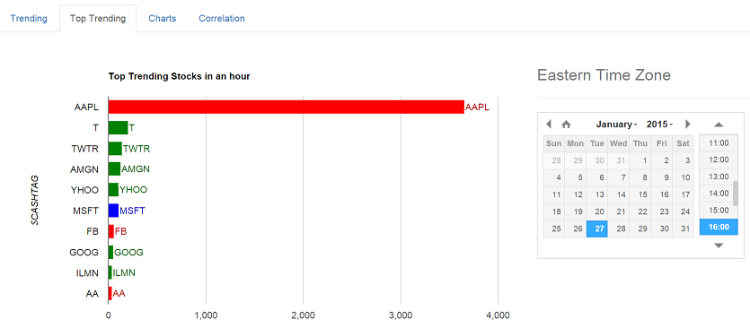
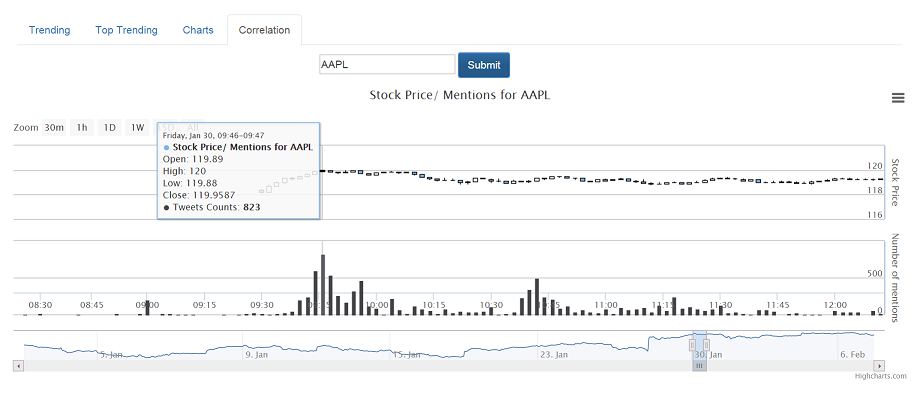
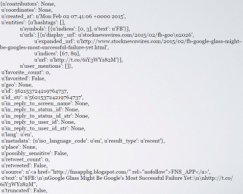
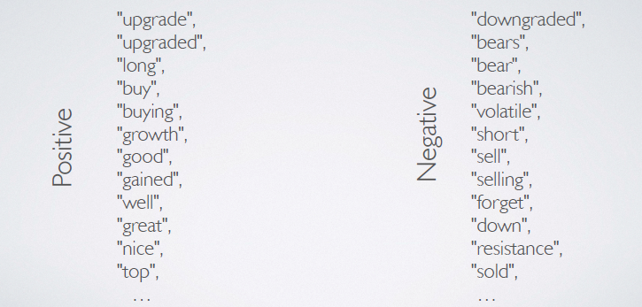
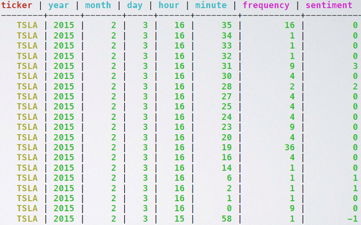

 #Cashtag
======================================

## Big data pipeline for user sentiment analysis on US stock market
[www.hashtagcashtag.com](http://www.hashtagcashtag.com)

 #Cashtag is a big data pipeline to aggregate twitter data relevant to different stocks for New York Stock Exchange (NYSE) and NASDAQ stock market and provides an analytic framework to perform user sentiment analysis on different stocks and finding the correlation with the corresponding stock price.

## What #Cashtag Does
 #Cashtag allows user to easily check the top trending stocks @twitter at different time.

Users can look into the historical data and discover the top trending stocks and sentiment of twitter users on that stock at different hours of the day.

Users can also find the time series information about a stock - how many time the stock has been mentioned over time as well as corresponding sentiment. 

 #Cashtag also allows user to find the correlation betweent the number of mentions of a stock @twitter and the stocks price fluctuation over time.

# How #Cashtag Works
 #Cashtag pipeline is based on $\lambda$ architecture.The pipeline consists of an ingestion layer, batch layer, speed layer, serving layer and frontend. The pipeline diagram is shown below:

 

## Data Ingestion
 #Cashtag works by pulling twitter data and stock market data. #Cashtag uses the twitter streaming API. Due to the limitation of this API, the current version is limited to pulling data for about 250 stocks including NASDAQ 100, NYSE 100 and some other popular stocks from these to exchange. 

 
 #Cashtag fetches stock price information from www.netfonds.no . The website provides sub-second interval level-1 stock prices delayed by an hour. #Cashtag fetches the stock information for each individual stock every 5 seconds. Some pre-processing is done on this stock information - e.g. adding a ticker information and a timestamp. 
 
 
 
 A multi-consumer multi-topic Kafka instance acts as the data ingestion platform. Both twitter data and stock data are stored in the Kafka first. Python scripts are written to perform these tasks.
 
# Source of Truth
Initially, the source of truth for #Cashtag was HDFS drive in the master EC2 node. Kafka consumer programs, written in python, fetch data from Kafka and write it to HDFS. Later, the source of truth was moved to Amazon S3 drives due to the ease of use.

# Batch Layer
The choice of tool for batch layer in #Cashtag is Spark. Codes are written in Scala. Several batch layer jobs are running periodically throughout the day, where the batch layer jobs are collecting raw data from S3 disk and performing necessary tasks and saving the results in the Serving layer. Azkaban is the tool of choice in #Cashtag to perform scheduling of different batch jobs. The reason for choosing Azkaban over crontab was the nice visual user interface, the ease of parallelizing of different tasks in the flow as well as its ability to restart a program in case of failure - and of course the fact that its called Azkaban! 

Several taks are performed by the batch layer:

  1. number of mentions of a stock over different time granularity - minute, hour, day, year etc.
  2. users' sentiment of the stock over different time granularity
  3. top trending stocks at different time granularity
  4. computing the high, low, open, close and volume data of different stocks at different time granularity.
  

## Sentiment Analysis

 #Cashtag also performs a very simple sentiment analysis over different trending stocks. While the main motivation behind creating #Cashtag was to create the underlying data pipeline that will enable the end users - data scientist, analyst to perform advanced algorithmic analysis to find the sentimets, I also felt it would be interesting to showcase the ability of this platform by showing a simple sentiment analysis. For this task, #Cashtag looks for keywords in each tweets and provides a score of +1 for every positive word it encounters and a -1 for every negative word. The overall sentiment of that tweet then is the sum of all the score of all the words in the tweet.
 

# Speed Layer

Speed layer in #Cashtag performs multiple operations. The tool of choice for speed layer is Spark Streaming. Codes are written in scala.

## Incremental algorithm to supplement batch layer

One of the motivation behind having a speed layer in lambda architecture is to supplement the batch layer. The batch layer implements re-computation algorithm that works on the entire sets of raw data and compute the necessary results. Since batch layer is working on the entire raw data set, it is generally time intensive and takes long time to process the entire sets of data. In such cases, speed layer works on the most recent data and provide real time result for these data. While the algorithm in batch layer was re-computation algorithm, the algorithm in speed layer is incremental in nature. 

In #Cashtag, one of the job of the speed layer is to find the number of mentions of a stock at different granularity. The same operation is also performed in batch layer. In speed layer in spark streaming, the data work on a window of data and make use of the 'updateStateByKey' reduce operation in Spark Streaming. Here, the key is ticker and minute level time. Whenever, the streaming job encounter a particular ticker at a particular time, it search for existing key. If found, it updates that key; if not found, it creates a new key.

## Speed layer only operation

Speed layer also calculates the top trending stocks over the last 10 minutes - this is a dashboard only operation that is being updated every 5 seconds. The spark streaming reduce operation 'reduceByKeyAndWindow' is specifally suitable for this task.

# Serving Layer

The choice of database for serving layer in #Cashtag is Cassandra. #Cashtag deals with a lot of time series data. Time series data operation is an excellent use case for Cassandra. An excellent article on the use of time series data for Cassandra can be found in http://planetcassandra.org/getting-started-with-time-series-data-modeling/.

Cassandra's data model is an excellent fit for handling data in sequence regardless of datatype or size. When writing data to Cassandra, data is sorted and written sequentially to disk. When retrieving data by row key and then by range, you get a fast and efficient access pattern due to minimal disk seeks - time series data is an excellent fit for this type of pattern. 

 public data from the United States Patent and Trademark Office (USPTO) 
and statistics from the Census Bureau, placing the files on the name node 
of a Amazon Web Services (AWS) cluster of Elastic Compute Cloud(EC2).  Specifically, a collection of Bash and Python 
scripts use Beautiful Soup to scrape the USPTO website to find the links to 
the relevant zip files.  The patent office releases new data weekly, which are
downloaded and updated with cron jobs.
  
The full fidelity zip files are immediately stored on the Hadoop Distributed File
 System (HDFS) for safe keeping via redundancy.  Some of the data is in simple 
Tab Separated Values (TSV) files, but the most recent patent information is
stored in highly nested XML files.  Semi-structured data like XML allows flexibile 
formatting, but can be tricky to parse on distributed systems, pulling out only
 the relevant information rather than the various tags (see sample below).

 
Unfortunately, the USPTO lists each patent on several different lines, which vary
greatly from patent to patent depending on the number of authors, organizations, etc.  This is imcompatible with most
 technologies in the Hadoop ecosystem, which typically require a single record 
on a single line.  For this reason, the XML files are cleaned and parsed using 
Bash and Python scripts before further processing within the Hadoop ecosystem.

  
To circumvent this bottleneck, I have wrote a meta-programming script that splits this workload 
onto the worker nodes.  This is accomplished by finding the ip addresses of the 
worker nodes using the *dfsadmin* command, then the *scp*, *ssh*, and *tmux* commands to distribute and run the 
relevant scripts.  This work around achieves scalability, but lacks the true fault
 tolerance of the Hadoop ecosystem.  

## Batch Processing

After this staging, the patents are converted into single-line JSON records for further cleaning with Hive.  
JSON still has the flexibility of semi-structured data, but without the added size 
from the closing tags of XML.  An example of the JSON data, with some of the 
relevant information highlighted, is shown below with pretty-print formatting in both the 
original XML and the JSON formats.

After processing and staging on the Linux File System of the nodes, the JSON 
records are placed on the HDFS, partitioned by the year of the patent.  The files 
are then loaded into Hive tables using the open source serialization/deserialization (SerDe) 
tools developed by [Roberto Congiu](https://github.com/rcongiu/Hive-JSON-Serde).  My Hive 
schema is shown below with the same nested structure as the JSON files.

This SerDe is perfect for my data, which is highly nested and has a very dynamic schema over the various 
years.  Unlike some of the native Hive tools, this SerDe allows me to ignore the 
superfluous information, and just extract what's needed.  More so, by taking full 
advantage of Hive, nearly two decades of data (around 50GB) can be calculated in a batch process of only 20 minutes...very cool!  
After this, the data is in the nice tabular form.

## Real-Time Queries

After this the data is aggregated over different time periods and placed into HBase in a highly denormalized form, facilitating
 real-time queries. This is done using short-fat tables with many, many columns that are automatically generated from scripts. 
By using multiple tables aggregated over different time granularities, the queries are easily sub-second for the whole data set.

 

For the front-end, I used the Thrift protocol via HappyBase with the Python Flask 
 library to setup a RESTful API.  This API is then queried for a nice visual UI, I modified 
the Java Script templates from Highmaps.  Feel free to play around and discover where innovation lives at 
[www.patentlyinnovative.net](http://www.patentlyinnovative.net).

